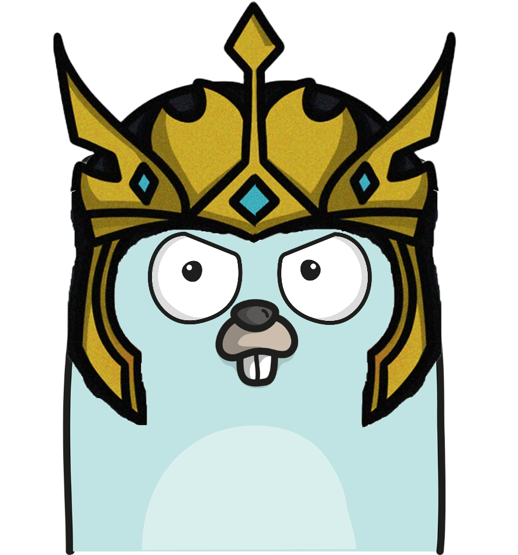
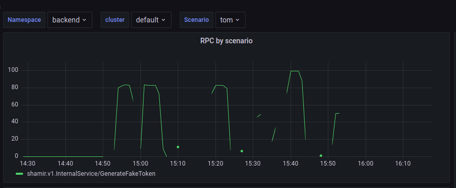
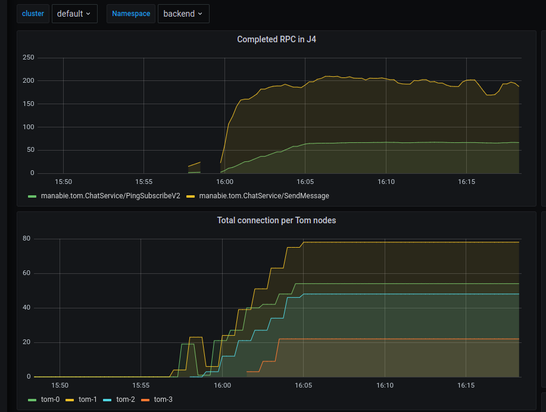

+++
date = "2022-08-23T17:10:49+07:00"
author = "duongcongtoai"
description = "TODO"
title = "J4 stress test framework"
categories = ["DevSecOps", "Testing"]
tags = ["Kubernetes", "integration-test", "Golang", "microservices"]
slug = "j4-stress-test-framework"
+++
## Why stress test

At Manabie, we have already implemented bunch of features for the business, mostly to support ERP in education domain. The traffic on production is not that high. For each cluster (of each clients), it barely reach 100 rpc on our Grafana dashboard, and everything looks safe. 
But no, we realize that in our roadmap, even though each cluster traffic is not that significant, but when they all combined into one single multi-tenant cluster (which is a topic for another day), we may encouter performance issues unprepared. And thus we have an epic to plan for stress test developing in our Kanban dashboard.

## Why another framework

What we want:
- Programmable interface (Golang): In Manabie, we write a lot of integration test using Golang, it is already a normal routine of every developer, and stress testing script is just another integration test script, but with high load and orchestrated by the stress test framework. Thus, we want our developer to feel indifference between writing integration test and stress test. Another reason for using programmable interface is that we want to inject custom metadata into the stressed test requests such as prometheus client side metrics, or Jaeger trace.
- Freedom of protocol: In Manabie we use different types of protocol: Grpc/Restful/Graphql. The framework should support or allow us to provide implementation for those protocols.
- Scalable deployment together with K8S: this is a quality we want in a framework (even though we may don't need it right now), that it can scale and integrate well with K8S ecosystem. We want to provide utility to our developer to stress test their service without complex setup: how many request to simulate, how fast the rpc increase, gradually or exponentially,... And the framework should behave correctly with what it promise. In order to do that, it must be deployed in cluster mode, into multiple containers with certain level of fault tolerant (aka one worker goes down, the workload must be handled by another newly spawned worker)


K6s and Locust are good options but they do not provide the option for a Golang friendly programmable interface. You may argue that language does not matter, but for us in this case it does.

Thus, J4 (Jarvan IV) was born
## Incubating J4 the stress test framework 

### Core concept
#### Scenario:

A scenario needs to (partially) make simulating requests, aka the requests the server have to serve if it were real user interactions. For example, for a chat feature, in order to have a chat, a user account must be created first, and then if that account is a student, then the system automatically create the chat for that students. There are of course a lot of business logic hidden inside the scenario, and we the platform team cannot write them all. It is the responsibility of feature developing teams. And example of a scenario used to stress the chat server looks like:

- create user account
- retrieve user token
- get the user's chat id
- create a session to the chat server (in our case is Grpc Server side streaming)
- establish a dedicated pinging routine to keep the previous session alive (this sounds weird, we have to do this pinging stuff for other reason that we can't explain in this article)
- after each interval, make a send message requests to the server
- in the meantime, if the stream receive the message, the stress test also need to receive it and maybe make some metrics from that information.

There are several issues with this approach is that:
- The framework must spam requests really fast, thus it need a pool of precreated user accounts. Else, by stress testing chat module, we accidentally stress test other modules (user module, firebase, ....). 
- The stream can be disconnected during the stress test, the scenario must be written to cover this case, that it will reconnect to the server if the stream is disconnected. 
=> The logic is not simple, and it is hard for a generic framework do support us this requirement from end to end.

#### Worker

This is an execution unit of J4 framework, it is just a for loop inside Golang that simultaneously executes a user defined function, something like:
```go
for {
    select {
        case <-ctx.Done():
            return
        default:
            myscenarioFunction(childCtx)
    }
}
```
J4 also provides user option to use closure to create the scenario function, to initialize some customized logic. We may need more sophisticated hooks later, but for now we only provide a simple closure to framework user.

```go

func myscenarioClosure(ctx context.Context) return func(context.Context) {
	userID := getSomeUserFromPool(ctx)
	streamID := createChatStreamForUser(userID)
	go pingToKeepStreamAlive(userID,streamID)
	return func(ctx context.Context) {
		sendMessageToChat(userID)
	}
}

myscenarioFunction := myscenarioClosure(ctx)
for {
    select {
        case <-ctx.Done():
            return
        default:
            myscenarioFunction(childCtx)
    }
}
```

#### Cycles

J4 organizes a scenario lifetime into 3 phases:

Rampup -> Hold -> Rampdown

Rampup: this phase is broken down into rampup cycles. After a configurable interval, the framework spawns a fixed number of goroutines, call workers. This makes the test create an increasing stress to the server (linearly). Rampup cycle ends when the targetcount of workers is reached.

Hold: during this period, the number of spawned workers are kept alive to do their job, making requests, making requests, making requests... The hold cycle ends after 
a configurable duration.

Ramdown: during this period, the framework gradually shutdown the spawned workers, also by a fixed number of workers after a configurable interval.


### Cluster mode
There are 2 types of nodes in a J4 cluster: distributor and executor
#### Task distributor
This node receive the definition of scenario (cycle definition, target count, rampup delay ...)
On the receipt of the scenario, it store the scenario info into a storage (rqlite), and distribute the workload to current executor.
If a new executor is added to the cluster, based on service discovery, the distributor reacts to this event by redistributing the load of current running scenarios, like "hey new guys have joined, you guys go ahead and update the tasks you have to do, if you have spawned more than you need, kill some goroutines, else, adjust the target count and only spawn up to that number" 

#### Task executor

This node is the one that actually runs the function defined by the scenario.

Each executor must obey what the distributor tells them, how much, how fast to spawn the workload. 

### Naive implementation of leader election

Currently we deploy all J4 nodes using the same configuration, but at runtime, one J4 must become the task distributor. Luckily, our storage that J4 uses is rqlite which has a RAFT module underneath => we borrow the function of leader election of RAFT to decide which J4 will become the task allocator.

This looks bad, because we layer above should not make assumption about the implementation of the layer beneath, which J4 does. But at least we have what we need immediately.
### Observability
#### Client side metrics gathering

J4 tries to support multiple protocol, including Grpc/HTTP/Grahql. The developers that write the stress test script must use the library provided by platform team, so that we can help them gather client side metrics in a generic fashion, for example, this is the code sample that inject some grpc client side metrics:

```go
import 	"go.opencensus.io/tag"

func injectCustomTagInterceptor(tagKey tag.Key, value string) grpc.UnaryClientInterceptor {
	return func(ctx context.Context, method string, req, reply interface{},
		cc *grpc.ClientConn, invoker grpc.UnaryInvoker, opts ...grpc.CallOption) error {
		newCtx, err := tag.New(ctx, tag.Insert(tagKey, value))
		if err != nil {
			return err
		}
		return invoker(newCtx, method, req, reply, cc, opts...)
	}
}

....

	commonDialOptions := []grpc.DialOption{
		grpc.WithBlock(),
		grpc.WithStatsHandler(&tracer.B3Handler{
			ClientHandler: &ocgrpc.ClientHandler{},
		}),
		grpc.WithChainUnaryInterceptor(injectCustomTagInterceptor(j4.ScenarioKey, scenarioName)),
	}

	commonDialOptions = append(commonDialOptions, opts...)
	conn, err := grpc.Dial(addr, commonDialOptions...)
```

This is the function that create a grpc connection to stress test some GRPC API for a scenario with name "scenarioName". The interceptor inject the scenarioname into the context, which will later on will be collected by the metrics collector. This will allow the metrics to be filtered by scenario name, for example 

This is a dashboard that shows all RPC by scenario name, in this case we have run J4 with a scenario named "tom", our chat service.
### General service metrics

These are default metrics platorm team prepare for each service, including:

- RPC
- Latency P99,P95,P90
- Error rate
- Request distribution on pods
- CPU usage
- Memory usage
- Asynchronous messages metrics
#### Team specific metrics
These are metrics created by the feature team to measure their own service. For example, chat team can measure the latency of message delivery, from the point the SendMessage request is established to the point the users in the chat receive that message in realtime. Those can not be controlled by platform team and have to be measured independently.

Example of team-spefific metric

## Room for improvement
### Isolate abtraction layers 
Relying on RAFT has caused us some troubles deploying J4 cluster (we still have bugs, and bugs in consensus are painful to discover). A lot of times, the whole cluster fails to elect a leader, because of random events causing the container to crash all over the place (dns resolver delay, leader timeout causing new leader to be elected ...), we can't explain all of them here, but we know that having a RAFT cluster that can add/remove nodes dynamically takes more than it gives.
For every J4 node, no matter what role it is (distributor or executor) we always embed a node of rqlite to it. Thus, we caused unnecesary overhead:
- 10 nodes in a healthy RAFT cluster means that the leader node needs to send heart beat to 9 other nodes, if if any data mutation happen, the leader also has to replicate its state change to those nodes. 
- J4 storage layer uses rqlite to retrieve data of scenario, tasks to execute,.. But after all, read requests always go to the leader node => the replicated data in the follower rqlite is only used for high availability in case the leader fails to connect. 10 backup nodes are unnecesary.

Although we may need many J4 nodes to execute the tasks, we don't actually need that much node to be highly-available. We realized that we have misunderstood some types of high-availability we want:
- highly available storage (rqlite)
- highly available task allocator (currently also the rqlite node that is firstly elected as leader)
- somewhat highly available workers

So, the enhanced version of J4 should be able to answer, what happen if one of those entities fail, and how to recover or setup a backup instance.
### Robust task distribution

At runtime, tasks executor can also fail (either crash or network partition). The task distributor need to recognize such event and redistribute tasks to the rest of current avaiable executors, or maybe spawn new ones if needed.


## Reference

- [RAFT paper](https://raft.github.io/raft.pdf)
- [K6S](https://k6.io/)