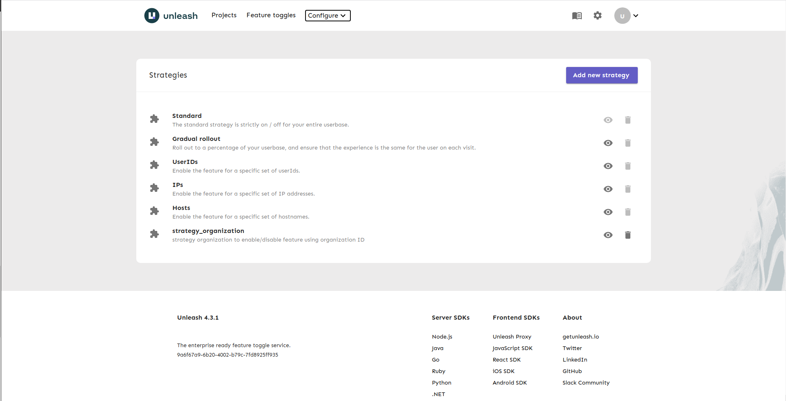
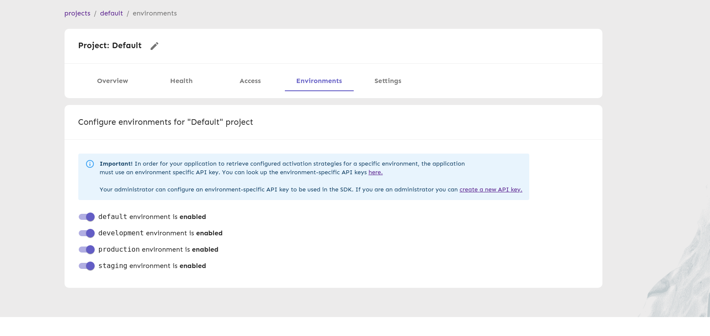

+++
date = "2021-12-29T14:28:23+07:00"
author = "nhattien.ho"
description = "Manage list feature flags with file yaml/json."
title = "Create feature flags using file in Unleash"
categories = ["Feature toggle", "Testing"]
tags = ["Feature toggle", "Unleash", "Node.js"]
slug = "manage-list-flags-with-file"
+++

In this blog, we will learn how to create a list of feature toggles in Unleash using file. First, let's learn some concept of feature toggle and Unleash 
#### What is feature toggle (feature flag)?
Feature toggle (Feature flag) is a technique that allows you to disable some functionality of your application, through settings, without having to deploy new code.
#### What is Unleash?
[Unleash](https://docs.getunleash.io/) is a feature toggle system, that gives you a great overview of all feature toggles across all your applications and services. It comes with official client implementations for Java, Node.js, Go, Ruby, Python and .Net.
#### Why do we use file to create feature flags instead of Admin UI?
In Manabie, we manage the addition and removal of feature flags with pull request, so we need a solution to manage the list of feature flags by file. Developers can see and change the list of feature flags by modifying this file, don't need to access the admin page. The list of feature flags will be updated after we deploy new code backend.
#### How to use file to manage list of feature flags in Unleash?
To run Unleash locally, we need:
* [Node.js](https://nodejs.org/en/download/) (version 14 or later)
* [PostgreSQL](https://www.postgresql.org/download/) (version 10 or later)
* [Create an unleash user and database.](https://docs.getunleash.io/deploy/database-setup)
##### Start Unleash server
* Create a new folder/directory on your development computer.
* From a terminal/bash shell, install the dependencies:
``` bash
 npm init
 npm install unleash-server --save
```
* Create a file called server.js, paste the following into it and save.
```javascript
const unleash = require('unleash-server');
let options = {
    db: {
        ssl: false,
        host: 'localhost',
        port: 9432,
        database: 'unleash',
        user: 'root',
        password: 'root',
    },
    server: {
        port: 4242,
    },
}
unleash
  .start(options)
  .then((unleash) => {
    console.log(
      `Unleash started on http://localhost:${unleash.app.get('port')}`,
    );
  });
```
* Run `server.js`:
```bash
node server.js
```
Once the Unleash server has started, you will see the message:
```bash
Unleash started on http://localhost:4242
```
The first time Unleash starts it will create a default user which you can use to sign-in to you Unleash instance and add more users with:
* username: `admin`
* password: `unleash4all`

This is UI Admin of Unleash:


##### Use startup import in Unleash to create list of feature flags
You can import a json or yaml file via the configuration option `import`:
```javascript
import: {
  file: "feature.yaml",
  keepExisting: true,
  dropBeforeImport: true,
 }
```
If you want the database to be cleaned before import (all strategies and features will be removed), set the `dropBeforeImport` parameter.
It is also possible to not override existing feature toggles (and strategies) by using the `keepExisting` parameter.

Note: *You should be careful when using drop parameter in production environments, as it will clean current state.*

Put `import` configuration to options in `server.js`:
```javascript
const unleash = require('unleash-server');
let options = {
    db: {
        ssl: false,
        host: 'localhost',
        port: 9432,
        database: 'unleash',
        user: 'root',
        password: 'root',
    },
    server: {
        port: 4242,
    },
    import: {
        file: "feature.yaml",
        keepExisting: false,
        dropBeforeImport: true,
    }
}
unleash
    .start(options)
    .then((unleash) => {
        console.log(
            `Unleash started on http://localhost:${unleash.app.get('port')}`,
        );
    });
```

##### Structure of file feature.yaml
Create a yaml file with the following structure: 
```yaml
version: 3
features:
  - name: feature_xxxx_v1
    description: 'feature_xxxx_v1'
    type: release
    project: default
    stale: false
    variants: []
  - name: feature_yyyyy_v1
    description: 'feature_xxxx_v1'
    type: release
    project: default
    stale: false
    variants: []
strategies:
  - name: strategy_organization
    description: strategy organization to enable/disable feature using organization ID
    parameters:
      - name: organizations
        type: list
        description: list of organizations
        required: true
    deprecated: false
featureStrategies:
  - featureName: feature_xxxx_v1
    projectId: default
    environment: development
    strategyName: strategy_organization
    parameters: {}
    constraints: []
  - featureName: feature_xxxx_v1
    projectId: default
    environment: production
    strategyName: strategy_organization
    parameters: {}
    constraints: []
  - featureName: feature_yyyyy_v1
    projectId: default
    environment: development
    strategyName: strategy_organization
    parameters: {}
    constraints: []
  - featureName: feature_yyyyy_v1
    projectId: default
    environment: production
    strategyName: strategy_organization
    parameters: {}
    constraints: []
environments:
  - name: default
    type: production
    sortOrder: 1
    enabled: false
    protected: true
  - name: development
    type: development
    sortOrder: 100
    enabled: true
    protected: false
  - name: production
    type: production
    sortOrder: 200
    enabled: true
    protected: false
  - name: staging
    type: production
    sortOrder: 300
    enabled: true
    protected: false
featureEnvironments:
  - enabled: true
    featureName: feature_yyyyy_v1
    environment: development
  - enabled: true
    featureName: feature_yyyyy_v1
    environment: production
  - enabled: true
    featureName: feature_xxxx_v1
    environment: development
  - enabled: true
    featureName: feature_xxxx_v1
    environment: production
```
In this file, we have: 

`features`: list of [feature toggles](https://docs.getunleash.io/user_guide/create_feature_toggle), a feature toggle includes *description*, *type*,[*variants*](https://docs.getunleash.io/advanced/toggle_variants) .... In this example, there are 2 feature toggles *feature_xxxx_v1* and *feature_yyyyy_v1*

`strategies`: you can define your list of custom [*strategies*](https://docs.getunleash.io/user_guide/activation_strategy). Unleash comes with a few common activation strategies. Some of them require the client to provide the unleash-context, which gives the necessary context for Unleash.In this example, I create a strategy named *strategy_organization*

`environments`: list of custom [*environments*](https://docs.getunleash.io/user_guide/environments).Environments is a new way to organize activation strategy configurations for feature toggles into separate environments. In Unleash, a feature lives across all your environments — after all, the goal is to get the new feature released as soon as possible — but it makes sense to configure the activation differently per environment.(Environments are available in Unleash v4.3.x and later)

`featureStrategies`: relationship between your custom feature flags, strategies, and environments.

`featureEnvironments`: relationship between your custom feature flags,and environments.

Let's start unleash server again

Now, `feature_xxxx_v1` and `feature_yyyyy_v1` has been added to the list:


In addition to the default strategies, `strategy_organization` has been added to the list:


Strategy of feature_xxxx_v1:


List of environment


#### Conclusion
Overall, I introduced how to create a list of feature toggles in Unleash using YAML file( can also use JSON file). This approach makes it possible for our developers to manage the list of feature flags in our source code.
You can read more about import and export in Unleash [here](https://docs.getunleash.io/deploy/import_export)