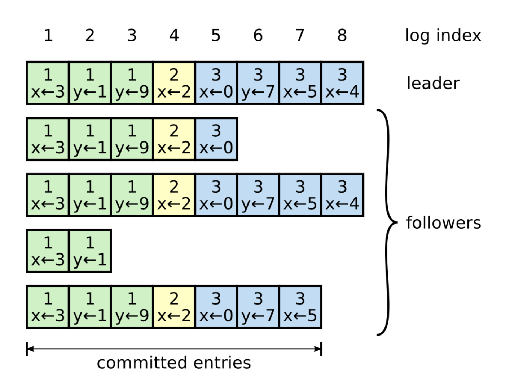

+++
date = "2022-04-01T10:00:00+07:00"
author = "duchh"
description = "Explaining how Raft work to achieve consensus between nodes"
title = "Raft consensus algorithms"
categories = ["Raft", "Consensus algorithm"]
tags = ["Raft", "Consensus-algorithm"]
slug = "raft-consensus-algorithms"
+++

***In this blog post, we will learn about Raft and the way it work to achieve consensus between nodes.***

#### **1. Consensus algorithm**

Consensus algorithm means you have a cluster node, you want all of the nodes in the cluster to have the same information, data,... 
In order to do that, Consensus applies a mechanism in the cluster we will have one server Leader, it has mission replicate data for 
all of other servers in the cluster. Another thing Consensus algorithm guarantee available for the cluster, for example, when sever Leader
is crashed the cluster will have another server instead immediately. Consensus algorithm properties include: safety, availability, integrity. 
Consensus algorithm is usually used in distributed systems to solve some consensus issues.

#### **2. Raft algorithm**
Raft is algorithm for managing a replicated log of the form. Raft implements by first electing a server Leader, then giving the Leader complete 
responsibility for managing the replicated log. The Leader accepts log entries from client, replicate them on other servers, and tell servers
when it is safe to apply log entries to their state machine. 

##### **2.1. Term**
* **Term** is a number marked for the period at the beginning of Leader voting until the vote is successful, the new Leader will manage 
replicated log until it is crashed (this term end). Or the term will end when the cluster doesn't have any Leader is chosen (i will explain 
the reason on 3.1.I)

##### **2.2. State**
All nodes in Raft have some state such as:
* **Follower**: This state just interacts with Leader and Candidate. If Leader's heartbeat occurs timeout, Follower will change state to 
Candidate or it will vote for another Candidate to become Leader when it is received RequestVote.
* **Candidate**: This state have a mission try to become Leader. When Follower become Candidate, the term will be increased by one, reset 
the time for voting Leader, then send RequestVote to other servers, if it has a vote number over half of servers in the cluster, it will be become 
Leader, if not it will back to Follower.
* **Leader**: Only the Leader can interact with the client. Leader has mission to replicate data for all nodes in the cluster. Only exist one 
Leader at the same time in the cluster. If the Leader occurs crash, it will back to Follower.

##### **2.3. Log replication**

Logs are composed of entries, which are numbered sequentially. Each entry contains the term in which it was created (the number in each box) 
and a command for the state machine. An entry is considered committed if it is safe for that entry to be applied to state machines. As you can see 
on the image above, committed entries from 1 -> 7 because the cluster has three nodes with the same value in total 5 nodes.

* **Data**: log index, the term number, value is contained on each entry.
* **Log committed**: Log committed means logs are replicated on over half of servers in the cluster. These logs are guaranteed will be 
replicated for all nodes in the cluster. 
* **Log up-to-date**: Raft will compare term and log entry between two nodes, if the term is different, the node's term is greater node 
is up-to-date. Another way is if the term of two nodes is equal, which log that is longer is node up-to-date.

##### **2.4. Request type**
In order to interact between nodes in the cluster, raft uses some requests such as:

* **RequestVote**: Candidate sends RequestVote to other nodes for voting it become the Leader. As you can see the image below, the request has 
arguments, results and implementation conditions. Regarding condition (2), if the result (votedFor) is null but the Candidate is up-to-date, 
the vote will be for it.

* **AppendEntries**: Leader uses this request to replicate log entries for all nodes in the cluster. It also has mission to send Leader's heartbeat 
to other servers.

##### **2.5. Safety**

Raft always guarantees these properties:

* **Election Safety**: at most one Leader can be elected in a given term.
* **Leader Append Only**: a Leader never overwrites or deletes entries in its logs. It only append new entries.
* **Log Matching**: If two logs contain an entry with the same index and term, then the logs are identical in all entries up through 
the given index
* **Leader Completeness**: If a log entry is committed in a given term, then that entry will be present in the logs of the leader for all 
higher-numbered terms.
* **State Machine Safety**: If a server has applied a log entry at a given index to its state machine, no other server will apply a different 
log entry for the same index. 

#### **3. How does raft work?**

##### **3.1 Leader election**

* You can see the image above, I will explain the process of Leader election: Leader uses AppendEntries to send heartbeat to Followers, 
timeout occurs when Follower can not receive heartbeat from Leader. This Follower will change state to Candidate, increase term by one, 
it will vote for itself, then send RequestVote to other servers. If this Follower has vote number over half of servers in the cluster, it 
will become Leader and begin to send (heartbeat) AppendEntries to other servers to avoid timeout from another server.

* **We have two case can happen here**:
    * **3.1.I** When the process of Leader election end, it may happen that there is no Leader at all. The reason is we have two Candidates 
    and they have the same vote number, this case is called **split vote**. In order to solve this problem, Raft chooses the solution 
    `randomize the timeout` of Followers (150-300ms). This solution solves that there will be no two Candidates at the same time. When Leader 
    is crashed, Follower with the smallest timeout will quickly recognize and start Leader election. You can see the image below: 

    

    * **3.1.II** During the process Leader election, Candidate can be received RequestVote from another Candidate. When this case happens,
    Raft will compare log entries of two Candidates, which Candidate isn't up-to-date, it will stop sending  RequestVote and back to Follower.

##### **3.2. Log replication**

* **Leader will replicate log for all nodes in the cluster. Raft manages consensus by Leader will overwrite logs are uncommitted**

* When the Client sends a request to server, the request will be received and processed by Leader. Then Leader sends AppendEntries with two
elements include: [ N: `{log entry, term}`, N-1: `{log entry, term}` ] (**N is nextIndex**). Follower will compare its data at 
latestIndex with **N-1**, if data is the same, Follower will append N into its log entry. If data is different, Follower will return result is fail 
for Leader, then Leader decreases index by one and send AppendEntries again with three elements include: [ N: `{log entry, term}`, 
N-1: `{log entry, term}`, N-2: `{log entry, term}` ]. Follower will compare its data at latestIndex with **N-2**. This operation will 
be repeated until data between Follower and Leader is the same, then Leader will overwrite all of logs in Follower `(N, N-1, N-2, N-n,...)`. 
    * For example, you can see the image below, Leader's term is 7, nextIndex is 11. Follower (a) is the same log with Leader at index 4, so 
    Leader will overwrite all logs of Follower (a) from index 4. Another Follower (b) is the same log with Leader at index 3, so Leader will 
    overwrite all logs of Follower (b) from index 3.

* **What happens when log replication is processing but Leader is crashed?** 

    

    **1.** At (a), S1 is Leader is replicating log with term-2 for S2, S3, S4, S5. But S1 is crashed.

    **2.** At (b), After leader election end, S5 becomes Leader with term-3, but S5 crashes immediately.

    **3.** At (c), S5 crashes, S1 restarts, is elected Leader with term-4 and continues replication. At this point, we have two case:

    **3.1** At (d), S1 crashes, it hasn't completed replicate term-2 for S3 yet. Then S5 is elected Leader by vote from S3, S4 and itself, 
    then S5 will overwrite term-3 for all nodes in the cluster.

    **3.2** At (e), S1 crashes, it has completed replicate term-2 for S3 and committed. At this point, S5 cannot be elected Leader 
    because its log isn't up-to-date.

#### **Conclusions**

Raft is the de-facto standard today for achieving consistency in modern distributed systems. It is designed to be easily understandable 
than Paxos algorithm, which is very hard to understand and implement. Any node in the cluster can become the leader. So, it has a 
certain degree of fairness.

* You can read more about Raft: https://raft.github.io/
* Raft is implemented by Go: https://github.com/yunuskilicdev/distributedsystems/tree/master/src/raft

