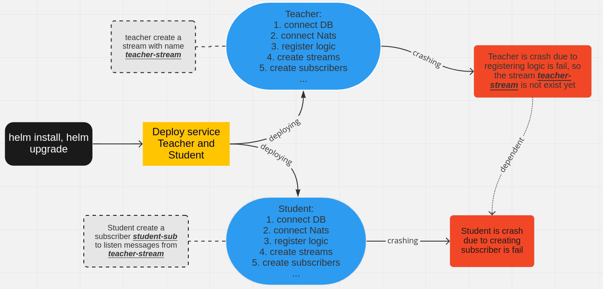

+++
date = "2022-08-23T10:00:00+07:00"
author = "duchh"
description = "A small approach we learned when migrating from monolithic to microservice"
title = "Removing dependency between microservices"
categories = ["Helm", "NATS-Jetstream"]
tags = ["Helm", "NATS-Jetstream"]
slug = "removing-dependency-between-microservices" 
+++

***In this blog post, I will show for you guys solution to solve the problem we have met when deploying in microservices***

#### Problem

A little bit information about our system:

**Helm**: It helps us install, upgrade, manage Kubernetes applications.

**Postgres**: We are using postgres version 13.1 for our database.

**Nats-jetstream**: We are using it for our message broker system. We also have a blog about 
[it](https://blog.manabie.io/2022/03/set-up-nats-multi-tenant-in-golang/).

Currently, our system is in process migrate from monolithic to microservice. We deploy our all services by one helm chart, their 
deploy process are parallel. In order to start a service, it requires some logics like: `connect DB success, connect Nats success, 
register logic, upsert streams of nats-jetstream, create subscriber of nats-jetstream,...` if one of these things fail then the deploy 
process fail too. So what is `upsert streams of nats-jetstream, create subscriber of nats-jetstream` means :thinking:?

1. **Upsert streams of nats-jetstream**: We write a library to check the `stream` by golang code. Is it exist? -> create a new one. 
Is it have any update? -> update it. Is it need to delete? -> delete it.

2. **Create subscriber of nats-jetstream**: We need a `subscriber` to listen messages are published from publisher then it will 
process messages base on our logic.

Scenario: This is a simulation about our system. We have two services `Teacher and Student`, **Teacher** service has a `teacher-stream` 
stream, **Student** service has a `student-sub` subscriber and this subscriber will subscribe `teacher-stream` to receive messages. 
If `teacher-stream` is not exist then `student-sub` is never be created -> **Student** service is depend on **Teacher** service, 
this architecture is really bad. So we decide need to refactor this architecture before it makes problem. As you can see the image 
above, when we deploy our application but `Teacher` service is fail then `Student` is service fail too.

#### Approach
At the beginning, we have some solutions:
1. We think we will create streams, consumers of nats-jetstream in one place, we can use [nack](https://github.com/nats-io/nack) 
to do that, but we have some custom logic when we want to `create, update, delete` stream or consumer. So this tool isn't enough 
useful with our use case.

2. We try to add logic `upsert teacher-stream stream` into both **Teacher** and **Student** services. Whether `teacher-stream` 
isn't created by **Teacher**, it can be created by **Student**. So we can guarantee **Student** is never crash 
due to `teacher-stream` isn't exist. But reality, we have a lot of subscribers subscribe to `teacher-stream` from other services. 
Another thing, we want only one service own that stream, because that stream should be only managed by one team, it has many configs, 
if other can modify its config not owner, this thing can make another problem. 

3. In this approach, we think about write a `job` to upsert stream, it solves two issues: we can use our library to work with 
nats-jetstream when we upsert stream, we can do that logic in one place. But the question is how/when we run this `job` :thinking:? 
The answer is we can use [helm hook](https://helm.sh/docs/topics/charts_hooks/). This approach is the best so we choose this 
solution for our system.

#### New architecture

As you can see the image above, we use `pre-hook` to run the `job` upsert stream first, if the hook runs fail then helm will fail 
and stop before deploying new version. On the order hand, the hook runs success then helm continue deploy services. As you can see, 
**Student** service is deployed success whether **Teacher** service is crashing. They are not dependent on together anymore 
:dancers: :dancers: :dancers: .

#### Conclusion
We have many other ways to solve this problem as long as it suits your system. At Manabie, we still have a lot of things need to do to 
migrate our system from monolithic to microservices. Thanks all of you read!!!